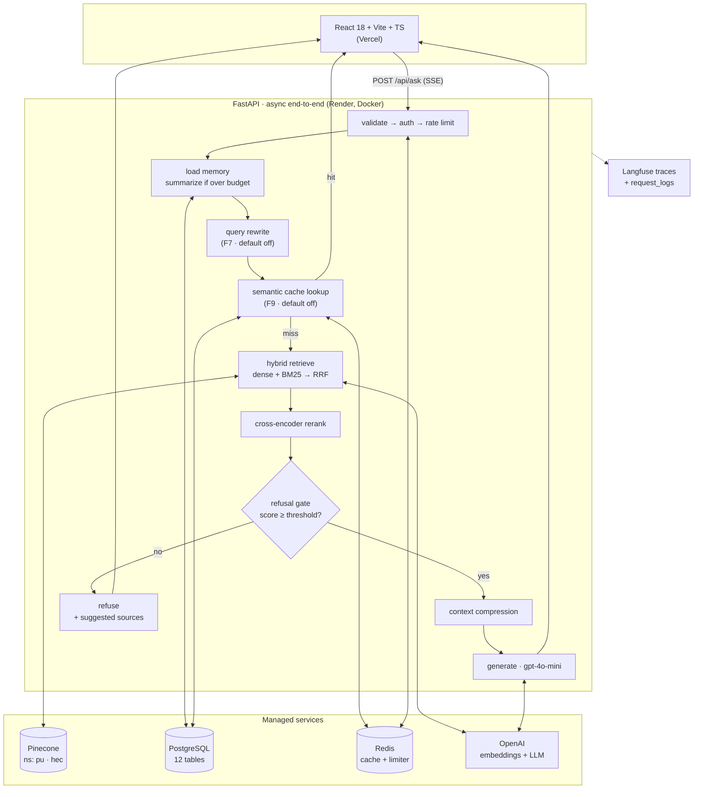

# CampusRAG

**A citation-first RAG assistant over University of the Punjab regulations and HEC policies.**

Every answer cites the exact document, section and page. When retrieval confidence is low the
system **refuses instead of hallucinating** — for a student asking whether they can sit an exam on
68% attendance, a confident wrong answer is worse than no answer.

Built for how the users actually type: typo-ridden, Urdu/English code-switched, on a phone.
*"probation se kaise nikalta hoon"* has to work.

```
┌─ Ask ─────────────────────────────────────────────────────────────┐
│  probation se nikalne ke liye kya CGPA chahiye?                    │
├───────────────────────────────────────────────────────────────────┤
│  ▸ searching       412ms    ▸ reranking     680ms                  │
│  ▸ compressing      92ms    ▸ generating   2.1s                    │
│                                                                    │
│  A student on probation must raise their CGPA to at least 2.00     │
│  within two consecutive semesters [1]. Failure to do so results    │
│  in ... [2]                                                        │
│                                                                    │
│  [1] PU Semester Rules (UG), §7.4, p.12                            │
│  [2] PU Semester Rules (UG), §7.5, p.13                            │
└───────────────────────────────────────────────────────────────────┘
```

---

## What makes this more than a demo

Most RAG projects stop at "it retrieves and answers". The interesting engineering here is
everything after that:

- **Every enhancement was measured, and two of them lost.** Hybrid search, reranking, query
  rewriting, compression and semantic caching each ship behind a flag and each has a committed
  before/after eval report. Query rewrite **regressed** headline hit@5 and ships default-off. So
  does the semantic cache, for a calibration reason explained below. Keeping a feature you built
  turned off because the numbers said so is the point.
- **Refusal is a first-class path**, gated on a calibrated cross-encoder threshold that was tuned
  on the eval set, not guessed.
- **Async end-to-end**, CI-enforced. Nine per-module CI jobs grep for sync twins (`.invoke`,
  `embed_documents`, blocking `requests`, sync `redis`) and fail the build on them. CPU-bound work
  (bcrypt, cross-encoder scoring, OCR, pickle loads) is pushed off the event loop explicitly.
- **The pipeline streams its own reasoning.** Ordered SSE frames (`stage` → `token` → `citations`
  → `meta` → `done`) let the UI show what each stage actually did, including what compression
  dropped and how reranking reordered the candidates.

---

## Architecture



Pipeline order is fixed and every seam is flag-checked; each emits paired `stage` SSE events
through a single emitter, so the UI needs no contract change when a stage is added.

---

## Benchmarks

Every number below comes from a committed report in [`docs/eval_results/`](docs/eval_results/).
Each label maps to a git SHA and an index manifest, so the numbers are reproducible.

### Retrieval — 75-question eval set (20 code-switched, 12 out-of-corpus)

| Label | hit@1 | hit@3 | hit@5 | MRR | Report |
|---|---|---|---|---|---|
| `baseline` (dense only) | 0.619 | 0.921 | **0.984** | 0.772 | [↗](docs/eval_results/baseline.md) |
| `f5-hybrid-after` | **0.683** | 0.905 | 0.921 | 0.787 | [↗](docs/eval_results/f5-hybrid-after-vs-baseline.md) |
| `f6-rerank-after` | **0.683** | 0.857 | 0.968 | **0.791** | [↗](docs/eval_results/f6-rerank-after-vs-f5-hybrid-after.md) |
| `f7-rewrite-after` | 0.667 | 0.873 | 0.952 | 0.780 | [↗](docs/eval_results/f7-rewrite-after-vs-f6-rerank-after.md) |
| `f8-compression-after` | 0.667 | 0.873 | 0.952 | 0.780 | [↗](docs/eval_results/f8-compression-after-vs-f7-rewrite-after.md) |

**Reading this honestly:**

- **Hybrid search bought precision and cost recall.** hit@1 +0.064, hit@5 −0.064. Unweighted RRF at
  k=5 promotes strong sparse hits and displaces dense ones. `table_lookup` questions gained the
  most (hit@1 +0.125) — exactly the exact-term rescue BM25 is for.
- **Reranking recovered the recall** (hit@5 0.921 → 0.968) by reordering a 12-candidate pool
  instead of truncating it, while holding the hit@1 gain. This is the one feature that did what the
  textbook says it would.
- **Query rewrite regressed everything slightly and triples retrieval cost** (~18s of a ~36s ask
  for the 3-way fan-out). It **ships default-off**. It is in the codebase because the multi-query
  fan-out is worth demonstrating, not because it helped.
- **Compression left retrieval identical by construction** — it operates after reranking, so it
  cannot change what was retrieved. Its effect is on tokens and faithfulness, below.
- **`baseline` still has the best hit@5.** Said plainly rather than buried: for pure top-5 recall,
  dense-only wins on this corpus. The enhancements buy precision at rank 1, which is what matters
  when the answer is generated from the top few chunks.

### Answer quality (RAGAS, `gpt-4o-mini` judge)

| Metric | `f7-rewrite-after` | `f8-compression-after` |
|---|---|---|
| faithfulness | 0.868 | **0.881** |
| answer_relevancy | **0.638** | 0.558 |
| context_precision | 0.629 | 0.628 |
| context_recall | 0.782 | **0.774** |

Compression traded answer relevancy for faithfulness — fewer, tighter chunks make the model stick
closer to the source and hedge more.

> **Known-invalid numbers:** the `false_refusal_rate = 1.0` in the f7 and f8 refusal suites is an
> artifact of a since-fixed test bug where the pytest run truncated the `documents` table out from
> under the eval corpus. Those refusal figures are **not** real and are not quoted here. The
> retrieval, RAGAS and latency numbers in the same reports were unaffected.

### Latency and cache

| Metric | `f8-compression-after` | `f9-cache-after` | Δ |
|---|---|---|---|
| p50 | 40.4 s | **3.9 s** | −36.6 s (10.5×) |
| p95 | 55.1 s | 51.9 s | −3.2 s |
| p99 | 157.6 s | 58.8 s | −98.8 s |
| cache hit rate | 0 | 0.500 | structural max for the workload |

30 requests over 15 unique questions, so 0.500 is the ceiling and the cache reached it. p50 is the
honest signal: half the requests are hits, so the *median* request is a cache hit. p95/p99 still sit
on the miss path.

Those absolute latencies are large because this run had the full pipeline on **including query
rewrite's 3-way fan-out**, against free-tier providers. See [the caveat](#a-note-on-the-latency-numbers).

**Why the semantic cache ships default-off.** The spec called for a 0.95 cosine threshold with a
Jaccard rule. Measured against an adversarial fixture set with real `text-embedding-3-small`
vectors, that was simply wrong: *nothing* reaches 0.95, so the semantic tier would never fire. Worse,
the true-paraphrase and adversarial sets **overlap** on cosine — the worst adversarial pair
(regulation 15(3) vs 15(4)) scores 0.930, above the best true paraphrase at 0.912. Cosine alone
cannot separate them. What does is a discriminative-token veto, which rejects 7/10 adversarial pairs
with zero false vetoes. With it, 0.86 keeps 2/8 paraphrases at zero collisions with a 0.032 margin.
That margin is thin, and thin margins on a system that must not cite the wrong regulation means the
semantic tier is opt-in. The Redis exact-match tier carries the real value.

---

## Quickstart

```bash
git clone <repo> && cd campus-rag
cp backend/.env.example backend/.env    # add your OpenAI + Pinecone keys

# Local stack: Postgres + Redis + API, migrations applied automatically
make bm25      # builds the BM25 index (needs the corpus ingested; see below)
make up        # → http://localhost:8000/api/health

# Frontend
make fe-install && make fe-dev          # → http://localhost:5173
```

Bare-metal (no Docker for the API):

```bash
make db-up && make migrate && make seed
cd backend && uvicorn app.main:app --reload
```

Populate the corpus (once, needs API keys):

```bash
cd backend
python -m app.ingestion.run --all
python -m app.indexing.run --strategy structure --namespace all
# On Windows: set PYTHONUTF8=1 so structlog can print the Urdu content.
```

`python -m app.indexing.run` **exits 0 on an empty corpus** — verify the vector counts in
`app/data/index_manifest.json` and against the Pinecone console rather than trusting the exit code.

---

## Operations

- **[Runbook](docs/runbook.md)** — key rotation, cache flush, corpus update → re-index → redeploy,
  migration rollback, reading a trace from a `request_id`, and what to do when `/api/health` is red.
- **[Load test](loadtest/README.md)** — Locust at 50 concurrent users, SSE consumed to the terminal
  frame, 80/20 repeat/novel mix, 30% multi-turn sessions.
- **Health:** `/api/health/live` (liveness, no dependencies — the platform probe) vs `/api/health`
  (per-dependency readiness; 503 when a core dependency is down).
- **Feature flags** are a deployment decision — env vars, no per-request override and no UI picker.
  There was a picker; its all-false client defaults applied last and silently pinned every browser
  request to the bare baseline regardless of server config.

---

## Stack

| Layer | Choice |
|---|---|
| Orchestration | **LangChain** — LCEL chains, loaders, splitters, retrievers, callbacks |
| Backend | **FastAPI**, Python 3.11+, **Pydantic v2**, fully async |
| Frontend | **React 18** + Vite + **TypeScript**, Tailwind, TanStack Query |
| Vector DB | **Pinecone** serverless (namespaces `pu` / `hec`) |
| Relational DB | **PostgreSQL** + **SQLAlchemy 2.0 async** + **Alembic** |
| Cache / rate limit | **Redis** (`redis.asyncio`) |
| Embeddings | OpenAI `text-embedding-3-small` (1536-dim) |
| LLM | `gpt-4o-mini` primary, `gpt-4o` deep mode |
| Parsing | **unstructured** + PyMuPDF fast path + **OCR** (Tesseract, eng+urd) |
| Sparse retrieval | **BM25** (`rank-bm25`) → **hybrid search** with RRF |
| Reranker | `cross-encoder/ms-marco-MiniLM-L-6-v2` (**sentence-transformers**, CPU) |
| Evaluation | **RAGAS** + custom hit@k / MRR harness |
| Auth | **OAuth2** password flow + **JWT**, bcrypt, **RBAC**, DB-backed token blacklist |
| Observability | **Langfuse** + structlog (JSON) + Postgres `request_logs` |
| Deploy / CI | **Docker** multi-stage, **GitHub Actions**, Render + Vercel, **Locust** |

---

## Repo layout

```
backend/app/
  api/         routers: ask, auth, documents, sessions, history, health, internal
  rag/         baseline chain + hybrid, rerank, rewrite, compression, trace
  ingestion/   downloaders, loaders (pdf/html/office/legacy), OCR, cleaning
  indexing/    chunkers (fixed | structure), embeddings, Pinecone upsert, BM25
  memory/      sessions, token accounting, rolling summariser, stage events
  caching/     two-tier semantic cache      evals/  the F4 harness
  auth/  db/  core/  observability/
frontend/      React chat UI
docker/        serving + ingestion images, compose
loadtest/      Locust
docs/specs/    requirements + design + tasks per feature
docs/eval_results/   one delta report per enhancement — the eval gate artifact
```

---

## A note on the latency numbers

The p50/p95 figures above were measured with **query rewrite on** (a 3-way retrieval fan-out) on
free-tier Pinecone and OpenAI. They are not a claim about how fast this architecture can be — they
are the honest measurement of the configuration that produced the eval labels. The deployed default
turns rewrite off, and the F9 cache hit path returns in ~3.3s p50.

The [load test](docs/loadtest/) will carry the numbers for the deployed configuration under
concurrency, which is the more useful figure. The harness is committed and verified; **the 50-user
run against a deployed URL is not done yet** — deployment provisioning is pending, and a run
against a laptop would measure the laptop.

---

## License

See [LICENSE](LICENSE).
